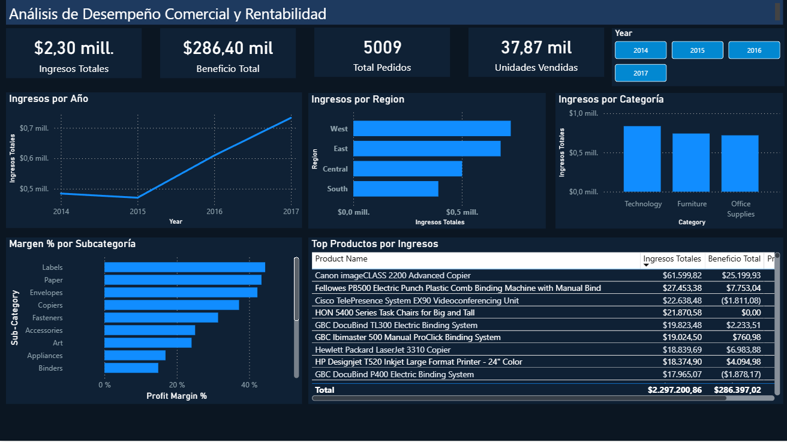

# Análisis de Desempeño Comercial y Rentabilidad

Panel ejecutivo en Power BI sobre el dataset Sample Superstore. Cubre el flujo completo desde el modelado de datos con DAX hasta la visualización interactiva para análisis de ventas y rentabilidad de una empresa de retail en EE.UU. durante 2014–2017.

---

## Objetivo

Dashboard ejecutivo que permite monitorear KPIs de ventas y rentabilidad, identificar patrones por región, categoría y subcategoría, y analizar el comportamiento de los productos más rentables del portafolio.

---

## Dataset

Sample Superstore — dataset público de ventas retail con información de pedidos, clientes, productos y geografía.  
Fuente: [Kaggle](https://www.kaggle.com/datasets/vivek468/superstore-dataset-final)  
Período: 2014 – 2017 | 9,994 registros | 4 regiones de EE.UU.

---

## Estructura del repositorio

```
desempeno-comercial-rentabilidad/
│
├── dax/
│   └── medidas_dax.txt       # Medidas DAX documentadas y comentadas
│
├── images/
│   └── dashboard_general.png # Captura del dashboard final
│
└── README.md
```

---

## Flujo del proyecto

**1. Modelado de datos en Power BI**  
Carga del CSV en Power Query, transformación y limpieza de columnas. Creación de columnas calculadas para análisis temporal: `Year` y `Year Month`. Modelo de datos con relaciones entre tablas para análisis por dimensiones.

**2. DAX — Medidas calculadas**  
Medidas que cubren desde agregaciones base hasta inteligencia de tiempo: ingresos acumulados en el año (YTD), comparación con el año anterior (Sales LY), variación porcentual año a año (Sales vs LY %) y participación de ventas sobre el total (Sales % of Total).

**3. Dashboard ejecutivo**  
Panel en una sola página con paleta oscura profesional, 4 KPIs, segmentador interactivo por año y 5 visualizaciones para analizar tendencia, distribución geográfica, rentabilidad por categoría y subcategoría y productos top.

---

## Medidas DAX

```dax
-- Métricas base
Ingresos Totales = SUM('superstore csv'[Sales])
Total Profit = SUM('superstore csv'[Profit])
Total Orders = DISTINCTCOUNT('superstore csv'[Order ID])
Total Units = SUM('superstore csv'[Quantity])

-- Rentabilidad
Profit Margin % = DIVIDE([Total Profit], [Ingresos Totales], 0)
Avg Order Value = DIVIDE([Ingresos Totales], [Total Orders], 0)
Avg Discount % = AVERAGE('superstore csv'[Discount])

-- Inteligencia de tiempo
Sales YTD = TOTALYTD([Ingresos Totales], 'superstore csv'[Order Date])
Sales LY = CALCULATE([Ingresos Totales], SAMEPERIODLASTYEAR('superstore csv'[Order Date]))
Sales vs LY % = DIVIDE([Ingresos Totales] - [Sales LY], [Sales LY], 0)
Sales % of Total = DIVIDE([Ingresos Totales], CALCULATE([Ingresos Totales], ALL('superstore csv')), 0)
```

---

## Dashboard



### KPIs principales

| Métrica | Valor total 2014–2017 |
|---|---|
| Ingresos Totales | $2.30 mill. |
| Beneficio Total | $286.40 mil |
| Total Pedidos | 5,009 |
| Unidades Vendidas | 37,870 |

### Visualizaciones

| Visual | Descripción | Insight principal |
|---|---|---|
| Gráfico de línea | Ingresos por Año | Crecimiento sostenido del 51% entre 2014 y 2017 |
| Barras horizontales | Ingresos por Región | West concentra el mayor volumen de ventas |
| Columnas | Ingresos por Categoría | Technology lidera en ingresos y margen |
| Barras horizontales | Margen % por Subcategoría | Labels y Paper tienen los márgenes más altos |
| Tabla | Top Productos por Ingresos | Canon imageCLASS 2200 lidera con $61,599 y 40.9% de margen |

---

## Principales hallazgos

- Los ingresos crecieron un 51% entre 2014 ($484K) y 2017 ($733K) con aceleración notable en el último año.
- West y East concentran el 62% de los ingresos totales. Central y South presentan oportunidades de expansión.
- Technology genera los mayores ingresos y el mejor margen de ganancia entre las tres categorías.
- Tables y Bookcases operan con márgenes negativos — una revisión de pricing o política de descuentos podría revertir esta situación.
- Canon imageCLASS 2200 Advanced Copier es el producto más rentable con $61,599 en ingresos y 40.9% de margen.
- Los picos de ventas se concentran en el último trimestre de cada año, patrón consistente en los 4 años analizados.

---

## Stack tecnológico

`Power BI` `DAX` `Power Query` `Git`

---

## Mejoras futuras

- Drill down dinámico de años a meses mediante navegación por marcadores
- Análisis de cohortes por segmento de cliente (Consumer, Corporate, Home Office)
- Forecast de ventas con funciones de inteligencia de tiempo en DAX
- Publicación en Power BI Service con actualización programada
- Análisis de descuentos vs rentabilidad por subcategoría

---

**Leonardo Latorre**  
